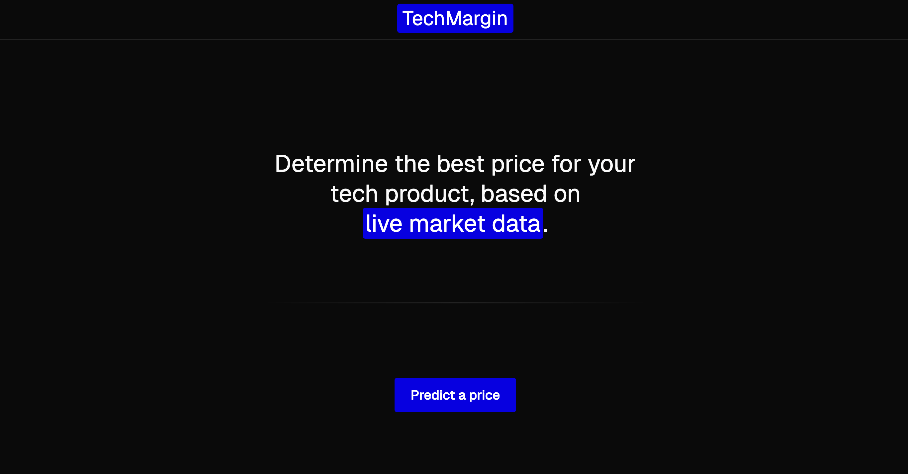
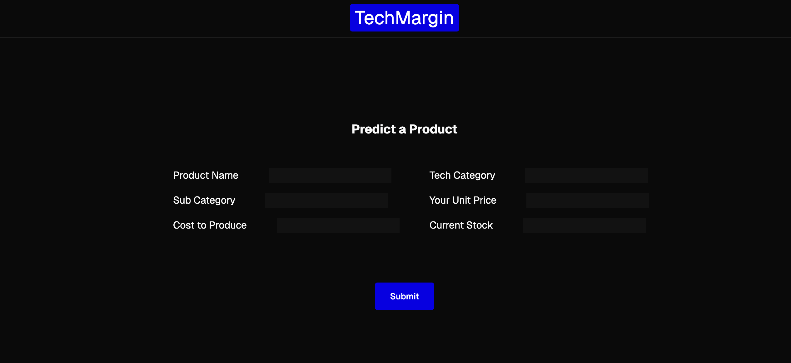

# TechMargin

TechMargin is a tool designed to help e-commerce suppliers find the optimal price point for their products. By leveraging market prices, the cost of goods sold (COGS), and inventory data, TechMargin calculates a predicted price that can help suppliers achieve better profit margins while staying competitive.

## Features

- **Product Input Form**: Suppliers can easily input details about their products, including name, category, sub-category, unit price, COGS, and current stock.
- **Price Prediction**: TechMargin analyzes the input data and predicts a competitive price point based on market trends.
- **Inventory Consideration**: The tool takes into account current stock levels to suggest price points that optimize for profitability and sales volume.
- **Market Price Aggregation**: The system aggregates data from market prices to provide a relevant pricing suggestion.

## How TechMargin Uses the eBay API

TechMargin integrates with the **eBay API** to gather real-time price data for products. This enables the system to pull competitor pricing and market trends from eBay listings, which are then used to help determine the optimal price point for the product.

1. **Fetching Market Prices**: TechMargin makes API calls to eBay’s product listings to fetch prices for similar items. The data retrieved includes the current selling price for similar products within the same category.
   
2. **Price Aggregation Calculation**: Using the prices fetched from eBay, TechMargin aggregates them to calculate an average market price. This helps identify how the market is valuing the product and what price range would be competitive.

## Price Aggregation & Best Price Calculation

The price aggregation and best price are calculated using a few key steps:

1. **Gathering Data**: TechMargin fetches market data using the eBay API for similar products based on the product's category and sub-category. This data is then used to get a sense of the current market price range for similar products.

2. **Price Calculation**:
   - The **cost of goods sold (COGS)** and **inventory** are factored in to determine the base price for the product.
   - **Price aggregation** is calculated by averaging the market prices retrieved from eBay listings. This aggregated price represents the current market price for similar items.
   - **Best Price**: The best price is determined by factoring in the COGS, desired profit margins, and competitive market prices. If the market price is higher than the COGS, the tool will suggest a price that falls within the market's range but also ensures the supplier achieves a healthy profit margin.

3. **Prediction Based on Trends**: The system looks at the predicted trends in the product's category (for instance, if there is increasing demand) and adjusts the price recommendation accordingly.

---

## Business Problem Solved

E-commerce suppliers often struggle to determine the right price for their products, which requires balancing several factors:

- **Cost of Goods Sold (COGS)**: The expenses to produce a product.
- **Inventory Levels**: The amount of stock available for sale.
- **Market Price Trends**: Competitor pricing and general market demand.

Without an automated system to help analyze these variables, suppliers risk overpricing or underpricing their products, leading to lost sales or diminished profit margins. TechMargin solves this problem by suggesting a pricing strategy based on real-time data, ensuring that suppliers can stay competitive while maintaining healthy margins.

---

## Screenshots

**Homepage:**

**Product Input Page:**

